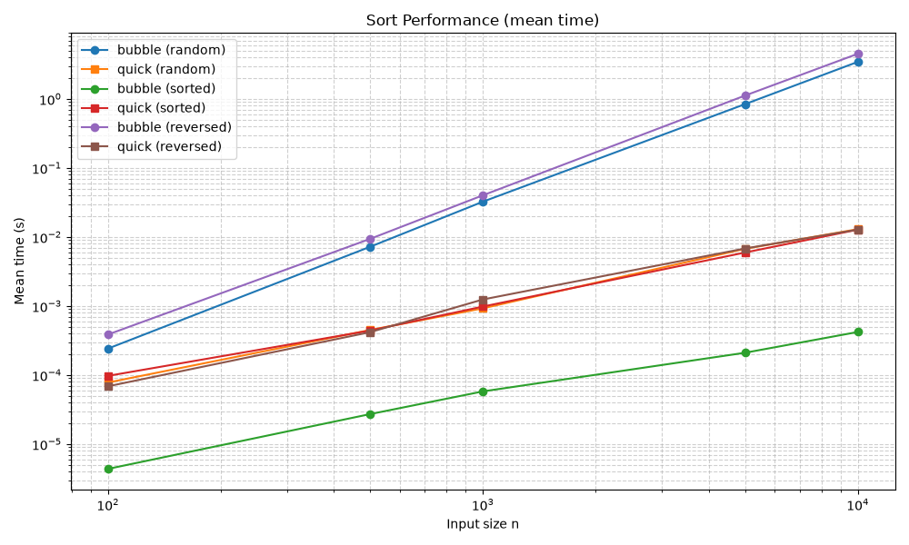

## Overview

This report compares bubble sort and quicksort using the benchmark results in `analysis/sort_results.csv`. Bubble sort is a simple comparison-based algorithm that repeatedly swaps adjacent out-of-order elements until the list is sorted. The implementation includes an early-exit check, so already sorted input can finish quickly. Quicksort is a divide-and-conquer algorithm that selects a pivot, partitions the list into smaller and larger values, and then sorts each partition recursively. In practice, quicksort is usually the better general-purpose choice because it scales far more efficiently on larger datasets.

## Method

Three input patterns were tested: random, sorted, and reversed. Five input sizes were used: 100, 500, 1,000, 5,000, and 10,000 elements. Each case was timed over repeated trials, and the mean and standard deviation were recorded. The graph below plots the mean execution times on logarithmic axes so the growth pattern is easier to compare across sizes.

## Results

The results show a clear difference in efficiency. Bubble sort on random data rose from about 0.00024 s at 100 items to 3.45 s at 10,000 items, and reversed data was even slower at 4.51 s for 10,000 items. By contrast, quicksort stayed close to 0.013 s for 10,000 items across all three dataset types. Bubble sort only looked competitive on sorted input because the early-exit condition reduced the work dramatically, reaching 0.00042 s at 10,000 items.

## Conclusion

The measurements match theory well. Bubble sort has $O(n^2)$ worst-case behaviour, which makes it unsuitable for large unsorted datasets, but it is easy to understand and acceptable for tiny or nearly sorted lists. Quicksort has expected $O(n \log n)$ performance, so it is much more practical for real-world sorting tasks such as application data processing, search indexing, and general-purpose in-memory sorting. Overall, the benchmark confirms that quicksort is the stronger default choice, while bubble sort is mainly useful for teaching and very small inputs.
